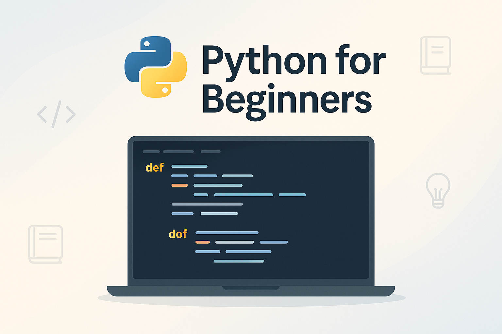

# My Python Course 🐍

This repository contains code examples, exercises, and notebooks used for teaching Python programming. It is designed for beginners and intermediate learners who want to gain hands-on experience with Python fundamentals, data types, control flow, functions, and more.

## 📂 Repository Structure

- `week1.1_basics.python` – Introduction to Python syntax and variables  
- `week1.2_control_flow.python` – If/else, loops, and logical conditions  
- `week1.3_functions.python` – Defining and calling functions  
- `week2_collections.python` – Lists, tuples, dictionaries, sets  
- And more...

> All `.python` files have been prepared to be converted to Jupyter notebooks for easier online execution.

---

## 🚀 Run the Notebooks Online

You can run all the notebooks directly in your browser using Binder:

No installation is needed — just click the button above and start learning Python in the cloud!

---

## 📢 License

This project is provided for educational purposes. Please feel free to clone, fork, and use in your own learning or teaching context.

---

## 👨‍🏫 Author

Developed and maintained by Ahmed Abdelaziz  
Feedback and suggestions are always welcome!
